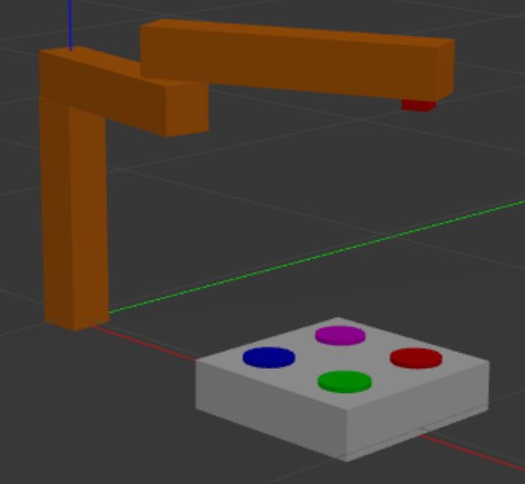
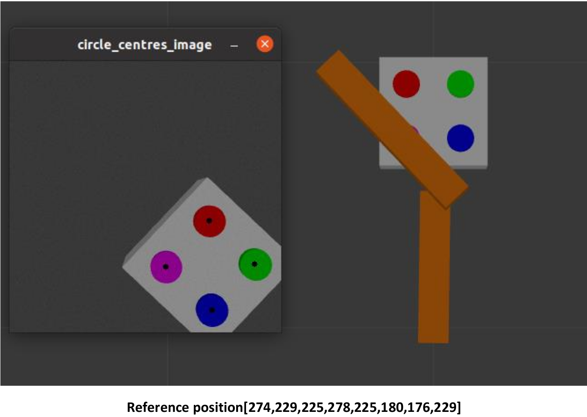
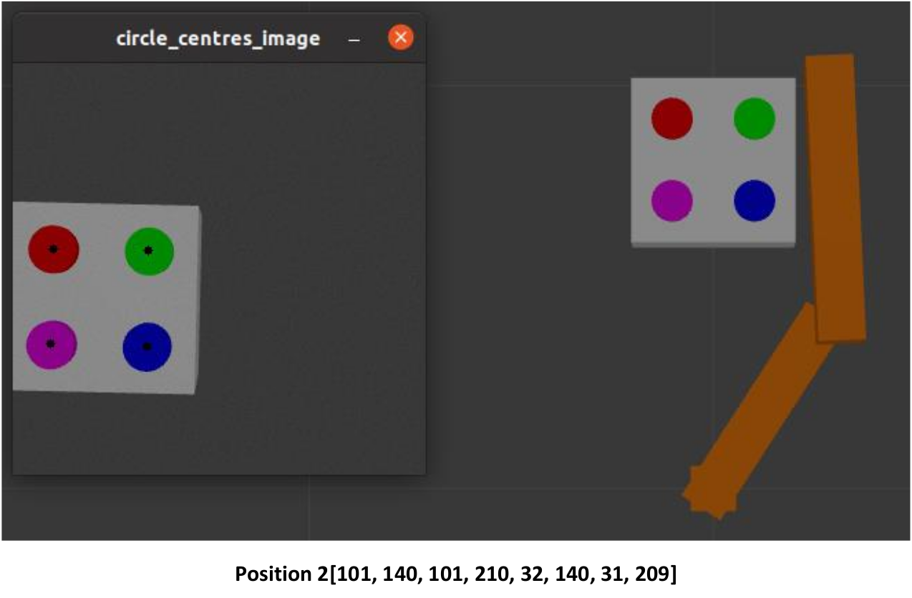
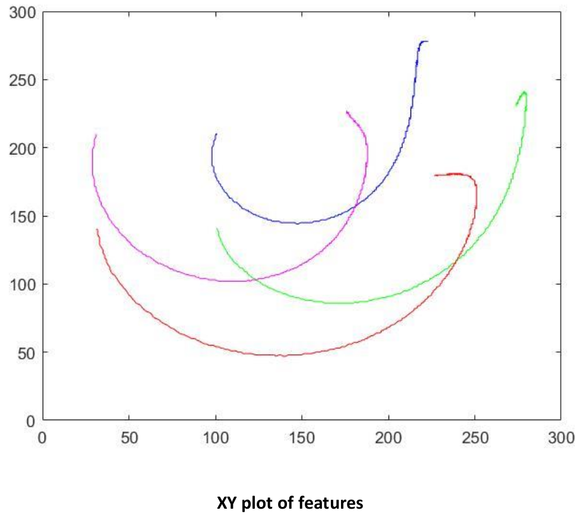

## Implementation of visual servoing algorithm for a 2 DOF Robot

### Methodology:
Step 1. Spawn the created object(rectangular block with 4 cylinders placed on top of it) on the ground within robot's workspace.

Step 2. Move the robot via the position controller so that the whole object is visible in the image. Take an image, get the coordinates of the 4 circle centers.

Step 3- Move the robot to a different location using the position controller. In the new location, the whole object should still be visible by the virtual camera. Take an image, get the coordinates of the 4 circle centers.

Step 4- Implement a visual servoing algorithm that uses these four point features (the centers of the circles) and servos the robot from one image configuration to the other.

### Implementation:
#### Step 1- 

#### Step 2-

#### Step 3-

#### Results (Cylinder Centres Trajectory plot)-

